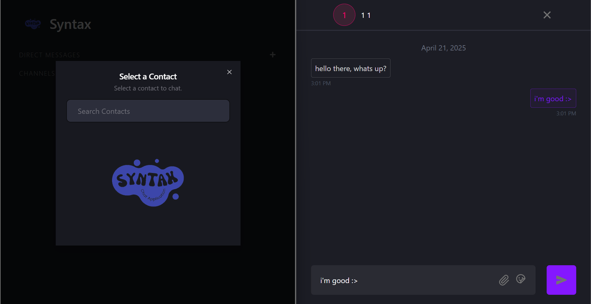

# Syntax

### App Features:
_Frontend_: Built with React  
_UI Components_: ShadCN  
_Styling_: Tailwind CSS  
_Responsiveness_: Fully Responsive Design  
_Authentication_: JWT Tokens  
_File Handling_: Multer for File and Image Storage  
_File Download_: Easy File Downloading  
_Real-time Messaging_: Sockets for Instant Communication  
_Chat Support_: Group Chats and Personal Messages  
_Fun Conversations_: Emoji Support  
_Backend_: Node.js and Express  
_Database_: MongoDB for Efficient Data Storage  
_State Management_: Zustand for Seamless State Management 
_API Calls_: Axios for Smooth API Interactions  
_Code Quality_: Structured and Maintainable Code 
